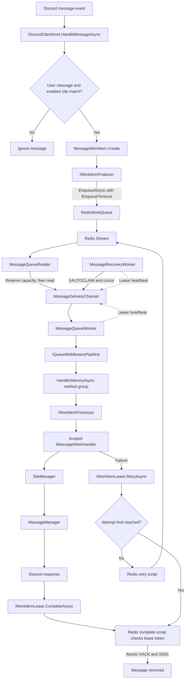

# Message Processing Flow

SaucyBot stores durable message work in Redis Streams. Message and interaction workers run the work through typed lifecycle middleware.

## Message flow

`DiscordClientHost.HandleMessageAsync` ignores bot messages and messages without an enabled site match. It creates a `MessageWorkItem` and calls the backend-neutral `IWorkItemProducer<MessageWorkItem>`.

The producer returns `EnqueueResult.Accepted` or `EnqueueResult.TimedOut`. Redis can accept an item after the caller stops waiting. The caller does not retry a timed-out enqueue.

`RedisWorkQueue` implements the producer and the backend-neutral `IWorkItemConsumer<MessageWorkItem>`. It stores the serialized work item in the Redis stream. It returns a `WorkDelivery<MessageWorkItem>` with the attempt, receive time, delivery ID, and lease.

`MessageQueueReader` reserves bounded handoff capacity before it asks the consumer for a new delivery. `MessageRecoveryWorker` uses the same handoff for recovered deliveries. The Redis adapter keeps its `XAUTOCLAIM` cursor across recovery scans and resets it after the final page.

Redis starts lease renewal when it creates a delivery. The lease stays active while the delivery waits in `MessageDeliveryChannel` and while a worker processes it. The worker passes the lease-loss token as cancellation to the handler.

`MessageQueueWorker` runs the delivery through `IQueueMiddlewarePipeline<MessageWorkItem>`. It passes the named `HandleDeliveryAsync` method group as the terminal step. That method calls `IWorkItemProcessor.ProcessAsync`, which creates a dependency-injection scope and resolves `IMessageWorkHandler`.

The scoped handler calls `SiteManager`. The manager checks permissions and guild rules, matches enabled site patterns, and calls the site implementation. `MessageManager` resolves the original Discord message and sends the result.

After the middleware pipeline succeeds, the worker calls `IWorkItemLease.CompleteAsync`. `RedisWorkItemLease` passes the lease token to `StackExchangeRedisStreamClient`. Redis checks ownership, then acknowledges and deletes the stream entry atomically. If the handler fails, the worker calls `IWorkItemLease.RetryAsync`. Redis keeps the item pending for recovery or deletes it when the attempt limit is reached.

If a lease is lost, the worker does not complete or retry the delivery. If a mutation has an unknown result, Redis retries that mutation once with the same lease token. The handler does not run again during that attempt. Recovery handles the item if Redis still lists it as pending.

## Interaction flow

Interactions do not use Redis. `DiscordClientHost` runs immediate interactions inline through `InteractionQueueWorker`. Other interactions use the bounded in-memory `InteractionWorkChannel`. A deferred interaction receives its initial defer response before the host admits it to the channel.

`InteractionQueueWorker` runs both paths through `IQueueMiddlewarePipeline<IInteractionWorkItem>`. Its named `ProcessInteractionTerminalAsync` method calls `IInteractionProcessor.ProcessAsync`. A processing failure sends an initial response when none exists, or a follow-up when the interaction already has a response.

The interaction path uses the same middleware registration extension as message work. Register `IQueueMiddleware<IInteractionWorkItem>` implementations with `AddQueueMiddleware<IInteractionWorkItem, TMiddleware>`. Keep interaction acknowledgements and failure responses in the interaction worker.

## Middleware and backend extension points

`IQueueMiddleware<T>` receives a typed `QueueWorkContext<T>`, a named `next` delegate, and a cancellation token. `QueueMiddlewarePipeline<T>` runs middleware in registration order. Each middleware must call `next` exactly once. The context does not expose lease operations.

Register middleware with `AddQueueMiddleware<TWork, TMiddleware>`. The module adds middleware through dependency injection. It does not change `QueueMiddlewarePipeline<T>`.

Message workers depend on `IWorkItemProducer<T>`, `IWorkItemConsumer<T>`, and `IWorkItemLease`. A backend implements these contracts without changing the reader, worker, or middleware. This release registers Redis as the production backend.

## Timeouts, recovery, and shutdown

`EnqueueTimeout` bounds how long the producer waits to add new work. `BackendOperationTimeout` bounds Redis lease renewal, completion, retry, and malformed-entry cleanup. `MaxProcessingTime` cancels a handler and stops lease renewal at the processing deadline.

.NET cannot stop a handler that ignores cancellation. The worker waits for that handler to return and does not complete its delivery. The `saucybot.queue.handler_overdue` metric counts handlers that remain active after cancellation. If every worker is stuck in such handlers, restart the bot process.

Message delivery is at-least-once. A handler can run again after a crash or an unknown completion result. Make external side effects safe to repeat. Lease tokens reject a stale worker's retry or completion, but they cannot undo a side effect that already happened.

During shutdown, the host stops intake and recovery scans. Workers drain admitted work for up to `ShutdownDrainTimeout`. Unfinished messages remain pending for recovery.

Do not run old and new queue workers at the same time during rollout. Old workers do not use lease tokens and can delete work after a new worker claims it.

## Metrics and tracing

`QueueMetricsMiddleware<T>` records `saucybot.queue.handler_outcomes` and `saucybot.queue.handler_duration`. The outcome values are `succeeded`, `failed`, and `cancelled`. These metrics use bounded work-type and outcome tags.

The Redis adapter records backend timeouts, lease renewals, lease loss, recovery, and malformed entries. `MessageQueueWorker` records `saucybot.queue.handler_overdue` when a handler remains active after cancellation. Worker supervisors record `saucybot.queue.worker_restarted`.

Metric tags do not include message IDs, interaction IDs, delivery IDs, or lease tokens. Queue depth counts available message work. It does not include deliveries in the in-memory handoff or work that workers already claimed.

OpenTelemetry exports metrics when enabled. Set `OpenTelemetry__OtlpEndpoint` and related values in the application configuration. See the [configuration reference](../user/setup/configuration.md#opentelemetry).

## Important files

| Responsibility | File |
|---|---|
| Receive Discord events and admit work | `SaucyBot/DiscordClientHost.cs` |
| Create message work items | `SaucyBot/Queue/MessageWorkItem.cs` |
| Backend-neutral producer and consumer | `SaucyBot/Queue/IWorkItemProducer.cs`, `SaucyBot/Queue/IWorkItemConsumer.cs` |
| Delivery and lease contracts | `SaucyBot/Queue/WorkDelivery.cs`, `SaucyBot/Queue/IWorkItemLease.cs` |
| Redis stream adapter | `SaucyBot/Queue/Redis/RedisWorkQueue.cs` |
| Renew, retry, and complete one lease | `SaucyBot/Queue/Redis/RedisWorkItemLease.cs` |
| Redis commands and recovery cursor | `SaucyBot/Queue/Redis/StackExchangeRedisStreamClient.cs` |
| Reserve handoff capacity | `SaucyBot/Queue/MessageDeliveryChannel.cs` |
| Read new deliveries | `SaucyBot/Queue/MessageQueueReader.cs` |
| Recover pending deliveries | `SaucyBot/Queue/MessageRecoveryWorker.cs` |
| Process message deliveries | `SaucyBot/Queue/MessageQueueWorker.cs` |
| Process in-memory interactions | `SaucyBot/Queue/InteractionQueueWorker.cs` |
| Register lifecycle middleware | `SaucyBot/Queue/QueueServiceRegistration.cs` |
| Compose lifecycle middleware | `SaucyBot/Queue/QueueMiddlewarePipeline.cs` |
| Record generic processing metrics | `SaucyBot/Queue/QueueMetricsMiddleware.cs` |
| Create scoped message handlers | `SaucyBot/Queue/WorkItemProcessor.cs` |
| Match sites and process links | `SaucyBot/Services/SiteManager.cs` |
| Build and send Discord responses | `SaucyBot/Services/MessageManager.cs` |
| Start, drain, and stop queue services | `SaucyBot/Queue/WorkQueueHostedService.cs` |

`ClearPendingOnStartup` deletes the entire stream. Do not enable it when you need to recover pending work after a restart.
