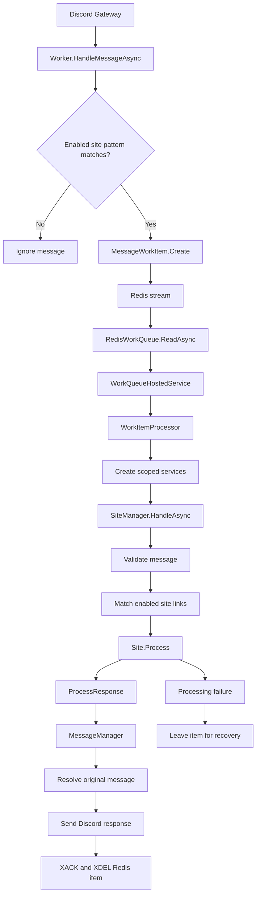

# Message Processing Flow

SaucyBot processes guild messages in two parts. The gateway receives the message. Queue workers process the message later.

## Flow

## 1. Receive the message

Discord sends a `MESSAGE_CREATE` event through the gateway.

`Worker.HandleMessageAsync` receives the event in `SaucyBot/Worker.cs`.

The worker ignores these messages:

- Messages that are not user messages
- Messages sent by the bot
- Messages with no match for an enabled site pattern

The pattern check uses `SiteRegistry.HasMatch`. It prevents ordinary chat messages from entering the Redis queue.

## 2. Create queue work

`MessageWorkItem.Create` creates a small, serializable message record.

The record contains:

- Message, channel, and guild IDs
- Author and role IDs
- Message content
- Forwarded message content
- Current embeds
- Required channel permissions
- An enqueue timestamp

The work item does not contain a Discord socket object or a file stream.

## 3. Add work to Redis

`RedisWorkQueue.EnqueueAsync` adds the serialized work item to the configured Redis stream.

The production queue uses Valkey with Redis-compatible commands. The queue uses the `Queue` section in the application configuration.

The queue uses a consumer group. Multiple workers can read different stream entries at the same time.

If Redis applies backpressure, the producer waits and retries. The item is not silently discarded.

## 4. Pick up work

`WorkQueueHostedService` starts the configured number of message workers.

Each worker calls `RedisWorkQueue.ReadAsync`. The worker then passes the entry to `WorkItemProcessor`.

`WorkItemProcessor` creates a dependency-injection scope for the item. It resolves the scoped site handler and processes the item through `SiteManager`.

## 5. Validate and match

`SiteManager.HandleAsync` creates a `QueuedMessageContext` from the work item.

The manager then:

1. Loads the guild configuration.
2. Checks message permissions and guild rules.
3. Matches the message against enabled site patterns.
4. Calls the matching site implementation.

The site returns a `ProcessResponse`. The response contains embeds, files, text, or components.

## 6. Send the response

`MessageManager` sends the response to the original Discord message.

The queued context resolves the original message from the Discord.NET cache first. If the message is not cached, it uses one REST lookup.

The original message can be deleted while the work item waits in the queue. In that case, Discord returns `Unknown Message`. SaucyBot records this as a debug event because the work is no longer deliverable.

## 7. Finish the queue item

After processing and sending succeed, the worker:

1. Acknowledges the Redis stream entry with `XACK`.
2. Deletes the entry with `XDEL`.

If processing fails, the worker does not acknowledge the item. The item remains available for the configured recovery path.

The worker records queue, worker, and processing metrics. OpenTelemetry also records message and interaction processing spans when tracing is enabled.

## Important files

| Responsibility | File |
|---|---|
| Receive gateway messages | `SaucyBot/Worker.cs` |
| Build queue work items | `SaucyBot/Queue/MessageWorkItem.cs` |
| Redis stream access | `SaucyBot/Queue/RedisWorkQueue.cs` |
| Run queue workers | `SaucyBot/Queue/WorkQueueHostedService.cs` |
| Create processing scopes | `SaucyBot/Queue/WorkItemProcessor.cs` |
| Validate and process links | `SaucyBot/Services/SiteManager.cs` |
| Build and send responses | `SaucyBot/Services/MessageManager.cs` |
| Site identifiers and pattern metadata | `SaucyBot/Services/SiteRegistry.cs` |
